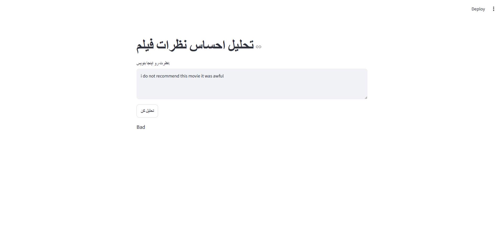

# IMDB Movie Review Sentiment Analysis

This project uses TF-IDF to vectorize comments and reviews. Logistic Regression 
and Multinomial Naive Bayes were used to compare model accuracy, with a Streamlit 
web interface to test the model interactively.

## DEMO

## HOW IT WORKS
I collected the dataset from Kaggle, containing 50,000 IMDB movie reviews..
I wrote a cleaning function using regular expressions (re) to remove HTML tags 
and punctuation. I compared two versions of preprocessing — with and without 
stopword removal — to see which performed better. used scikit-learn library to vectorize comments so computer can detect each word
The data was split 80/20 into training and test sets and used 2 libraries LogisticRegression and MultinomialNB 
to compare the accuracy also used joblib to save vectorizer and Logistic Regression model
and Streamlit web interface to visualize the result and test the model

## RESULTS
accuracy using MultinomialNB: 0.8676010890390239

accuracy using LogisticRegression: 0.8975496621962287

classification_report using LogisticRegression :

              precision    recall  f1-score   support

           0       0.91      0.88      0.90      4939
           1       0.89      0.91      0.90      4978

    accuracy                           0.90      9917
   macro avg       0.90      0.90      0.90      9917

weighted avg       0.90      0.90      0.90      9917

confusion_matrix using LogisticRegression : 

[[4352  587]
 [ 429 4549]]

## Installation

pip install -r requirements.txt

## Usage
streamlit run app.py
## Limitations
the model struggles with sarcasm/irony because TF-IDF doesn't capture context